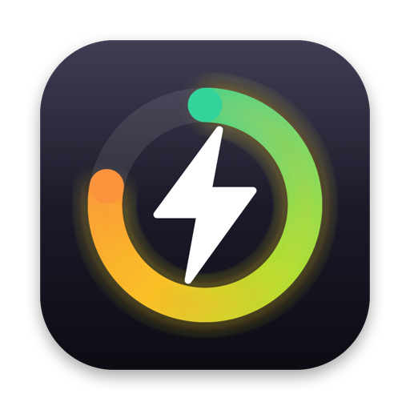
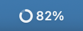
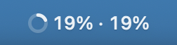
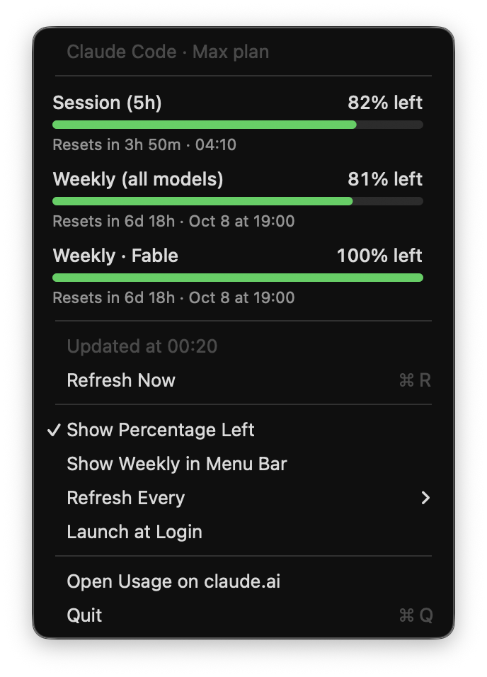
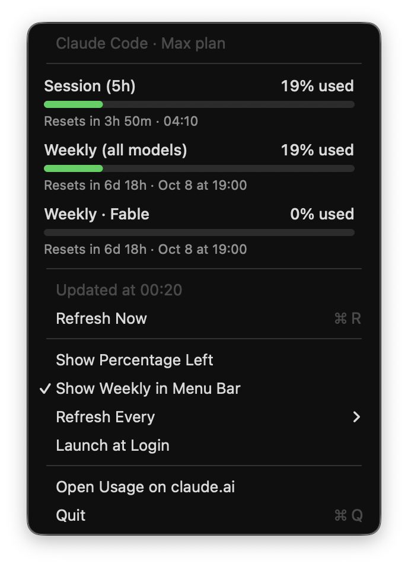

<div align="center">
  <a href="https://github.com/filippofinke/vibemeter">
    
  </a>
  <h3 align="center">Vibemeter</h3>
</div>

> Know how much vibe coding you have left. Your Claude Code limits, live in the macOS menu bar.

No more typing `/usage` mid-flow. Vibemeter shows your Claude Code session limit as a ring and a percentage, and one click shows every window with when it resets.

## Features

- [x] Session (5h) limit left right in the menu bar
- [x] Weekly and per-model limits with progress bars and reset times
- [x] Turns orange at 80% used and red at 95%
- [x] Toggle between % left and % used, optionally show the weekly limit in the bar
- [x] Zero setup: reuses the Claude Code login already in your Keychain
- [x] Native Swift, two files, no dependencies, ~0% CPU

## Screenshots

| Menu bar | Weekly in menu bar |
| :---: | :---: |
|  |  |

| % left | % used |
| :---: | :---: |
|  |  |

## Quick Start

Prerequisites

- macOS 13 or later
- [Claude Code](https://claude.com/claude-code), signed in with a Pro or Max plan

Download

Grab `Vibemeter.dmg` from the [latest release](https://github.com/filippofinke/vibemeter/releases/latest) and drag Vibemeter into Applications. The app isn't notarized, so the first time macOS blocks it: open **System Settings → Privacy & Security** and click **Open Anyway**, or run:

```bash
xattr -dr com.apple.quarantine /Applications/Vibemeter.app
```

Build from source (needs `xcode-select --install`)

```bash
git clone https://github.com/filippofinke/vibemeter.git
cd vibemeter
./build.sh --install
```

This builds a universal `Vibemeter.app`, copies it to `/Applications` and launches it. `./build.sh --dmg` builds `build/Vibemeter.dmg`. Turn on **Launch at Login** from the menu.

Check it from the terminal

```bash
build/Vibemeter.app/Contents/MacOS/Vibemeter --print
```

## How it works

Claude Code stores its login in the Keychain under `Claude Code-credentials`. Vibemeter reads that token and calls the same endpoint `/usage` uses (`api.anthropic.com/api/oauth/usage`). The token never leaves your Mac except for that request, and nothing is written to disk.

## Notes

- The token is refreshed by Claude Code. If you haven't run `claude` for a while, Vibemeter shows a warning until you do.
- The usage endpoint rate-limits bursts. On a 429, Vibemeter keeps the last numbers and backs off.
- Refreshes every 5 minutes by default (1 to 15 in the menu), on wake, and when you open the menu.

## Contributing

Open a pull request against `main` with a [Conventional Commits](https://www.conventionalcommits.org) title (`feat: …`, `fix: …`). PRs are squash-merged, and [release-please](https://github.com/googleapis/release-please) turns them into a release PR that bumps the version and updates the [changelog](CHANGELOG.md). Merging it publishes a GitHub release with the DMG attached.

## Author

👤 **Filippo Finke**

- Website: [https://filippofinke.ch](https://filippofinke.ch)
- Twitter: [@filippofinke](https://twitter.com/filippofinke)
- GitHub: [@filippofinke](https://github.com/filippofinke)
- LinkedIn: [@filippofinke](https://linkedin.com/in/filippofinke)

## Show your support

Give a ⭐️ if this project helped you!

<a href="https://www.buymeacoffee.com/filippofinke">
  
</a>

## 📝 License

Copyright © 2026 [Filippo Finke](https://github.com/filippofinke).<br />
This project is [MIT](./LICENSE) licensed.

***

_Not affiliated with Anthropic._
